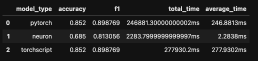

# AWS Neuron sdk

AWS Neuron is the SDK for [AWS Inferentia](https://aws.amazon.com/machine-learning/inferentia/), the custom designed machine learning chips enabling high-performance deep learning inference applications on [EC2 Inf1 instances](https://aws.amazon.com/ec2/instance-types/inf1/). Neuron includes a deep learning compiler, runtime and tools that are natively integrated into TensorFlow, PyTorch and MXnet. With Neuron, you can develop, profile, and deploy high-performance inference applications on top of `[EC2 Inf1 instances](https://aws.amazon.com/ec2/instance-types/inf1/).

**Resources**
* [Whats new/Release notes](https://awsdocs-neuron.readthedocs-hosted.com/en/latest/release-notes/index.html#neuron-whatsnew)
* [Github Repository](https://github.com/aws/aws-neuron-sdk)
* [Documentation](https://awsdocs-neuron.readthedocs-hosted.com/en/latest/neuron-intro/get-started.html)
* [Hugging Face Transformers Example](https://awsdocs-neuron.readthedocs-hosted.com/en/latest/neuron-guide/neuron-frameworks/pytorch-neuron/tutorials/tutorial-torchserve.html)
* [Installation Guide](https://awsdocs-neuron.readthedocs-hosted.com/en/latest/neuron-intro/install-pytorch.html?highlight=install)
* [transformers optimization documentation](https://huggingface.co/transformers/serialization.html?highlight=onnx)
* [Medium article "PyTorch JIT and TorchScript"](https://towardsdatascience.com/pytorch-jit-and-torchscript-c2a77bac0fff)
# Getting started:

Currently there is no version of `neuron-sdk` for Mac therefore I created a `dockerfile` to use it in a virtual environment. 

There are two examples one from AWS (`aws_tutorial_bert.ipynb`) and one I created (`simple_mrpc_example.ipynb`) while working with `aws-neuron-sdk`. 


## Setup Dev environment

```Bash
make build
```
## Compile model

Currently, the model is hardcoded into `compile_model.py`

```bash
python compile_model.py
```

# Deploy

# Tests


